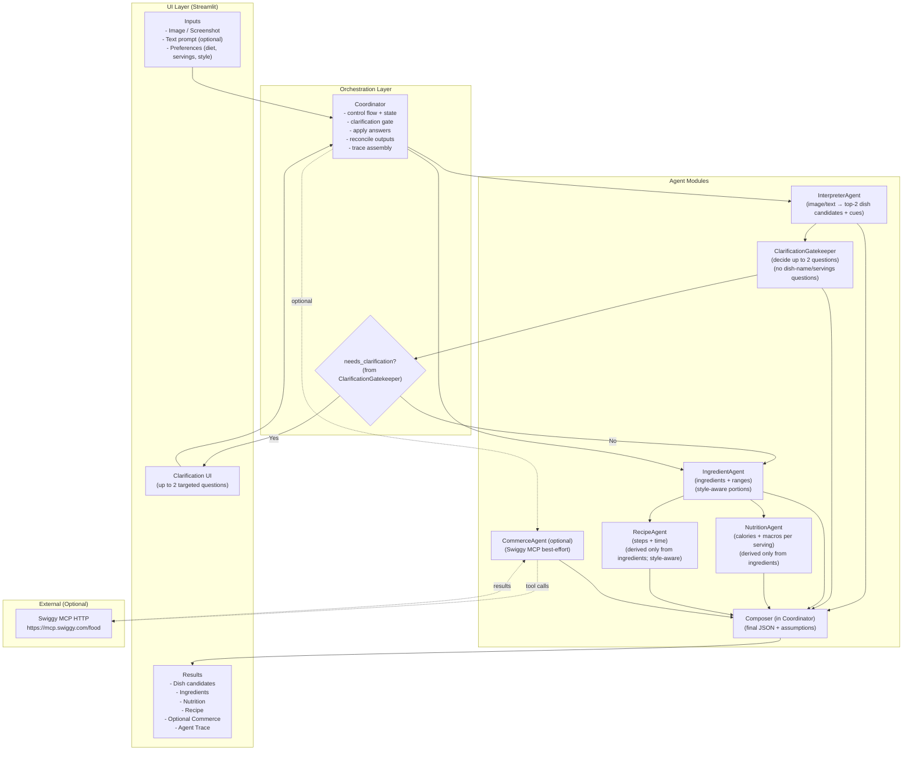

# EatSense 

EatSense is a multimodal, agentic food-understanding prototype that takes a food image/screenshot or a dish description and produces: dish candidates, a structured ingredient list, a simple recipe, and an estimated calorie + macro breakdown.

## Why / Problem Statement

In real life (especially when you're trying to stay consistent with fitness goals), a common pain point is logging food:

- You eat something (homemade or ordered), but you don't know the exact ingredients or portions.
- You end up searching manually: *what dish is this, what's inside it, and what could the macros be?*
- Estimating calories/macros becomes slow, inconsistent, and error-prone.

EatSense is built to reduce that friction: **snap (or paste) → clarify quickly if needed → get ingredients, recipe, and a reasonable nutrition estimate with explicit assumptions.**

## What It Does

- **Multimodal input:** image upload (food photo/screenshot) and/or text prompt.
- **Dish identification:** returns top-2 candidates with confidence.
- **Clarification gate:** asks up to **2** targeted questions when uncertainty or conflicts exist; blocks downstream steps until answered.
- **Ingredient extraction:** structured list with rough quantity ranges and servings assumption.
- **Recipe generation:** uses the ingredient output only; respects **home-style vs restaurant-style** preference.
- **Nutrition estimate:** uses the ingredient output only (temp=0 / deterministic-ish) and outputs assumptions.
- **Optional commerce lookup (small demo):** best-effort Swiggy MCP lookup (non-blocking; falls back gracefully).


## Why Agents (Not a Single Prompt)

EatSense is intentionally **not** implemented as a single “one-shot” prompt.

Key differences:

- The system **pauses and asks clarifying questions** when confidence is low.
- Ingredients are a **required intermediate artifact**.
- Both **Nutrition** and **Recipe** are derived **only from the processed ingredient output**, not raw user input.
- When users answer clarifications (e.g., servings), **only dependent steps are recomputed**.
- Each agent has a single responsibility and produces **inspectable outputs** via an Agent Trace (useful for debugging/judging).
This design improves **reliability, and determinism** compared to a monolithic prompt.


## Run

```bash
python -m venv .venv
source .venv/bin/activate
pip install -r requirements.txt
cp .env.example .env
# add OPENAI_API_KEY to .env
streamlit run ui/app.py
```

## Demo Steps

1) Upload a food image/screenshot **or** type a dish description.
2) Set preferences (diet, servings, style).
3) Click **Analyze**.
4) If prompted, answer up to **2** clarification questions.
5) Review: dish candidates, ingredients, nutrition, and recipe.

## Architecture / System Design

The system is implemented as a **multi-agent coordinator** (single process) that routes tasks to specialized agent modules and reconciles outputs.



### Coordinator Responsibilities

- Runs agents in the correct order and enforces the **clarification gate**.
- Applies user clarifications (reruns only dependent steps).
- Resolves conflicts (example: recipe dish name mismatch vs top dish candidate).
- Produces an **Agent Trace** (JSON) for judge/debug visibility.


### Data Flow Guarantees (by design)
- **RecipeAgent** consumes the ingredient output only.
- **NutritionAgent** consumes the ingredient output only.
- Commerce is optional and never blocks core results.

## Repo Structure

```text
agents/          # Specialized agent modules
orchestrator/    # Coordinator + orchestration wrappers
ui/              # Streamlit UI
utils/           # I/O + OpenAI helpers
```

## Commerce (Optional, Non-blocking)

If you have Swiggy MCP credentials, the app can try a best-effort lookup for the detected dish. If auth is missing/blocked (401), the demo still works without commerce.

To enable:

- Set `SWIGGY_MCP_ENABLED=true`
- Ensure `mcp.json` includes `swiggy-food`:

```json
{
  "mcpServers": {
    "swiggy-food": { "type": "http", "url": "https://mcp.swiggy.com/food" }
  }
}
```

If your Swiggy MCP setup requires auth, set `SWIGGY_MCP_AUTH_HEADER` and `SWIGGY_MCP_AUTH_TOKEN` in `.env`.

## Notes

- This is a hackathon prototype: outputs are **estimates** with explicit assumptions, not medical advice.
- Nutrition/macros are computed from the ingredient output (temp=0 / deterministic-ish), and will not match every real-world recipe.
- Commerce is optional and non-blocking; auth/whitelisting constraints may prevent true end-to-end ordering in some environments.
